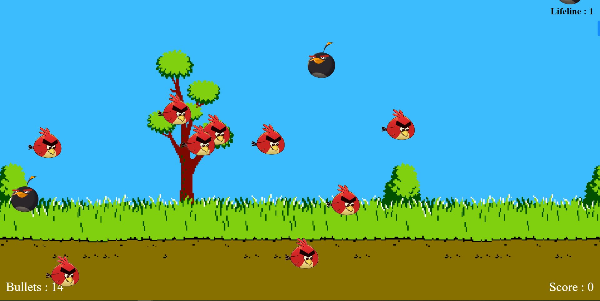

# Angry Bird Shoot Game

## Description

- Game is built with HTML, CSS and Javascript DOM Manipulation. 
- Used CSS animation dynamically using JS.

## Instruction to Play

- Game has two Angry birds. The Red & The Black.
- Player has 14 Bullets & 1 Lifeline.
- Player can shoot bird using **Mouse Click**.
- Player has to shoot Red Angry bird. It will give you point.            
    - If Player shoot all Red Bird, Score will be 12 and He will won the game.
    - If Player can't shoot all Red Bird, His score will bellow 12, Then Game will Over.
- If Player shoot Black bird. It will decrease your point & your lifeline will be 0.
    - If Player has 0 lifeline and If he shoots black bird, then Game will over.
- Game has bonus point, If you shoot the coin It will Either refill your bullets or lifeline.

## Demo

[Game Demo](https://vidishashah25.github.io/angrybird-shoot-game/)